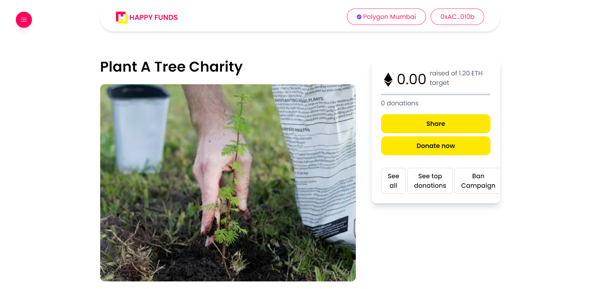

# HappyFunds Project Documentation(Ethereum + Polygon track)

<!-- Read the full tutorial here: **[>> How to build a Decentralized Event Marketplace with Next.js, TypeScript, Tailwind CSS, and Solidity](https://daltonic.github.io)** -->


The `DappFund.sol` project is a Solidity-written Ethereum smart contract that serves as the backbone of a decentralized application (dApp) for charity purposes. It leverages the OpenZeppelin library to ensure secure and standardized development of the contract.


The contract is designed around two primary structures: **CharityStruct** and **SupportStruct**, representing a charity and a supporter, respectively.

## Key features:

- **createCharity**: Allows a user to create a new charity.
- **updateCharity**: Allows the charity owner to update the details of an existing charity.
- **deleteCharity**: Allows the charity owner or contract owner to delete a charity.
- **toggleBan**: Allows the contract owner to ban or unban a charity.
- **donate**: Allows a user to donate to a charity.
- **changeTax**: Allows the contract owner to change the tax percentage.
- **getCharity**: Returns a single charity by its ID.
- **getCharities**: Returns all existing charities.
- **getMyCharities**: Returns all charities created by the caller.
- **getSupports**: Returns all supporters for a specific charity.

## Running the Application

Supply the following keys in your `.env` variable:

```sh
NEXT_PUBLIC_RPC_URL=http://127.0.0.1:8545
NEXT_PUBLIC_ALCHEMY_ID=<YOUR_ALCHEMY_PROJECT_ID>
NEXT_PUBLIC_PROJECT_ID=<WALLET_CONNECT_PROJECT_ID>
NEXTAUTH_URL=http://localhost:3000
NEXTAUTH_SECRET=somereallysecretsecret
```

`YOUR_ALCHEMY_PROJECT_ID`: [Get Key Here](https://dashboard.alchemy.com/)
`WALLET_CONNECT_PROJECT_ID`: [Get Key Here](https://cloud.walletconnect.com/sign-in)

Follow these steps to run the application:

1. Install the package modules by running the command: `yarn install`
2. Start the Hardhat server: `yarn blockchain`
3. Run the contract deployment script: `yarn deploy`
4. Run the contract seeding script: `yarn seed`
5. Spin up the Next.js development server: `yarn dev`

Now, your application should be up and running.

## 📚 Key Technologies

- **Next.js (React Framework)**:

  - Used for building the frontend of the application.
  - Facilitated the development of server-side rendered and static web pages for efficient performance.
  - Enabled seamless navigation and a smooth user experience.

- **TypeScript**:

  - Implemented to bring static typing to JavaScript, enhancing code readability and catching potential errors during development.
  - Improved collaboration among developers by providing clear interfaces and type definitions.

- **Hardhat (Ethereum Smart Contract Development)**:

  - Used as the development environment for creating and deploying Ethereum smart contracts.
  - Simplified the process of compiling, deploying, and testing smart contracts on the Ethereum and Polygon networks.

- **EthersJs**:

  - Integrated for interacting with the Ethereum and Polygon blockchains.
  - Facilitated the communication between the frontend and the smart contracts, enabling the execution of blockchain transactions.

- **Redux-Toolkit**:

  - Implemented for state management within the React application.
  - Managed the global state, making it easier to handle complex state logic across different components.

- **Tailwind CSS**:

  - Utilized as a utility-first CSS framework to style the frontend components.
  - Streamlined the styling process and maintained a consistent design across the application.

- **@rainbow-me/rainbowkit-siwe-next-auth**:

  - Integrated for authentication in Ethereum dApps.
  - Provided secure and seamless authentication for users interacting with the charity donation platform.

- **React-Toastify**:

  - Used for displaying toast notifications to users.
  - Enhanced the user experience by providing real-time feedback on actions such as successful donations or charity updates.

- **Swiper**:

  - Implemented as a modern mobile touch slider for interactive and visually appealing components in the application.

- **Wagmi**:
  - Used for building Ethereum dApps.
  - Streamlined the development process by providing tools and utilities specifically designed for decentralized application development.

## Smart Contract Design

- **CharityStruct and SupportStruct**:
  - Represented the data structures for charities and supporters, respectively.

## Key Features Implementation

- **createCharity, updateCharity, deleteCharity, toggleBan**:

  - Implemented in the smart contract to allow users and contract owners to manage charities efficiently.

- **donate**:

  - Enabled users to make donations to a specific charity, updating the corresponding support structures.

- **changeTax**:

  - Allowed the contract owner to adjust the tax percentage, providing flexibility in the platform's financial model.

- **getCharity, getCharities, getMyCharities, getSupports**:
  - Implemented to retrieve information about charities, supporters, and user-specific charities.

## Ethereum and Polygon Integration

- **Ethereum**:

  - Our charity donation platform leverages the Ethereum blockchain, a decentralized and widely recognized platform for building smart contracts and decentralized applications (dApps).
  - Ethereum serves as the backbone for our project, ensuring the security and reliability of our smart contracts.

- **Polygon**:
  - In addition to Ethereum, we've seamlessly integrated Polygon into our platform.
  - Polygon is a scaling solution for Ethereum, providing faster transactions and lower fees.
  - By incorporating Polygon, we enhance the user experience by reducing transaction costs and improving the overall efficiency of our web3 charity donation platform.
